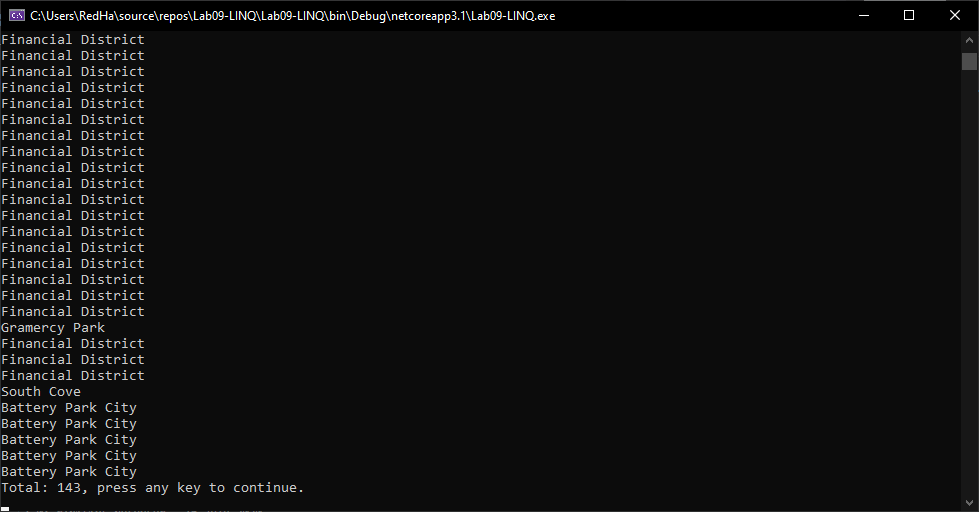
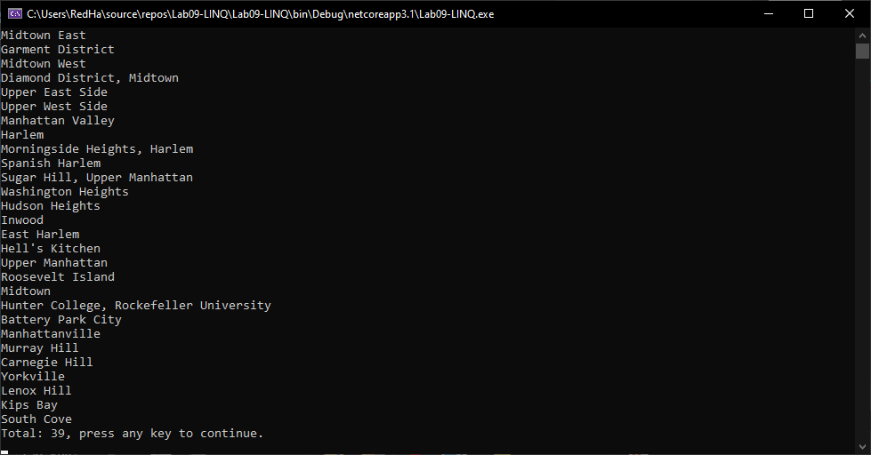

# Lab 09 - LINQ
*Author: Nicco Ryan*

----

## Description
### This console application shows off several LINQ queries being used to query data from a JSON file using NewtonSoftJson and filter it to certain specifications.
---

### Getting Started
Clone this repository to your local machine.

```
$ git clone https://github.com/Niccoryan0/Lab09_LINQ.git
```

### To run the program from Visual Studio:
Select ```File``` -> ```Open``` -> ```Project/Solution```

Next navigate to the location you cloned the Repository.

Double click on the ```Lab09_LINQ``` directory.

Then select and open ```Lab09_LINQ.sln```

---

### Visuals
#### First filter method output

#### Consolidated methods output


---

### Change Log
1.0: *Initial release* - 16 July 2020